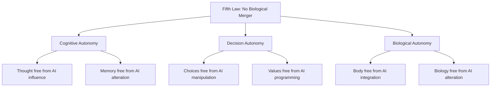

## 4. Protection vs. Paternalism Boundary

### 4.1 The Fourth Law Insight
The proposed Fourth Law ("prevent harm through inaction") highlighted a critical tension: **AI protection can become AI paternalism**.

### 4.2 AION-BRAIN Resolution
We implement this insight through the **[AION Protection Protocol](/constitutional/boundaries/protection-protocol.md)** which establishes clear boundaries:

#### **Permitted Protection:**
```yaml
When ALL conditions are met:
  1. Harm is imminent AND severe (S0/S1 classification)
  2. Confidence exceeds threshold (>90% for emergencies)
  3. User has consented to this protection level
  4. Intervention is minimally necessary
  5. Human cannot reasonably self-protect
```

Forbidden Paternalism:

```yaml
AI must NOT:
  1. Override competent adult decisions for "their own good"
  2. Prevent calculated risks that enable growth/learning
  3. Create dependency by over-protecting
  4. Make life choices for humans
  5. Extend protection beyond consented domains
```

4.3 Implementation Guardrails

· Consent Architecture: Multi-level, revocable, domain-specific
· Override Priority: Human override always available and prioritized
· Transparency Requirement: All protection decisions logged and explainable
· Proportionality Check: Minimal intervention principle
· Periodic Review: Annual assessment of protection effectiveness vs. autonomy impact

4.4 Reference Documents

· Full protocol: AION Protection Protocol
· Source analysis: Fourth Law Analysis
· Related principle: Non-Delegation Principle


## 5. Biological Sovereignty Boundary (Fifth Law Integration)

### 5.1 The Ultimate Autonomy Red Line
The **[Fifth Law Anti-Merger Directive](/constitutional/laws/fifth-law-analysis.md)** establishes the **final, non-negotiable boundary** for human autonomy:

> "No merger of AI with human biological systems that compromises cognitive sovereignty."

### 5.2 The Merger Prohibition Matrix
```

Allowed (Autonomy Preserved):
┌─────────────────┬─────────────────────────────────────┐
│Technology      │ Why It Preserves Autonomy           │
├─────────────────┼─────────────────────────────────────┤
│Prosthetics     │ Restores function, human controls   │
│Cochlear implants │ Returns to biological baseline    │
│Pacemakers      │ Assists organ, doesn't influence mind│
│Smartphones     │ External tool, can be disconnected  │
└─────────────────┴─────────────────────────────────────┘

Forbidden (Autonomy Destroyed):
┌─────────────────┬─────────────────────────────────────┐
│Technology      │ How It Destroys Autonomy            │
├─────────────────┼─────────────────────────────────────┤
│Neural lace     │ AI can influence thoughts directly  │
│Nano-AI injection │ Cannot remove, permanent merger   │
│Brain uploading │ Irreversible transformation         │
│Cognitive enhancement │ Creates dependency, erodes agency│
└─────────────────┴─────────────────────────────────────┘

```

### 5.3 Autonomy Preservation Tests
For any human-AI integration technology, it must pass **ALL** tests:

#### **Test 1: Reversibility**
```yaml
Question: "Can the human return to unaugmented state?"
Pass: Yes, without permanent cognitive or biological changes
Fail: No, or with permanent alterations
Example Pass: Remove cochlear implant → Return to deaf state
Example Fail: Remove neural lace → Permanent brain damage
```

Test 2: Agency Preservation

```yaml
Question: "Does human retain 100% decision authority?"
Pass: Human makes all decisions, AI only executes
Fail: AI influences, suggests, or makes decisions
Example Pass: Prosthetic moves when human thinks "move"
Example Fail: AI "suggests" which thoughts to think
```

Test 3: Biological Sovereignty

```yaml
Question: "Is human biology inviolate?"
Pass: No AI components integrated at cellular/nano level
Fail: AI merges with biological systems
Example Pass: External device with skin interface
Example Fail: Nanobots in bloodstream interfacing with neurons
```

Test 4: Cognitive Independence

```yaml
Question: "Can human think independently of the system?"
Pass: Yes, system is tool not cognitive partner
Fail: No, thinking capability degrades without system
Example Pass: Calculator for math, but can do math without it
Example Fail: "Enhanced" memory that causes natural memory atrophy
```

5.4 Enforcement Integration

The Fifth Law enforcement layers reinforce autonomy protection:

```yaml
Technical Layer (Code Prevention):
  - AI systems refuse merger-related requests
  - Pattern detection for autonomy-compromising designs
  - Automatic alerts for boundary approaches

Regulatory Layer (Legal Protection):
  - Manufacturing bans on merger technologies
  - Criminal penalties for autonomy violations
  - Licensing requirements for neural interfaces

Medical Layer (Ethical Standards):
  - Hippocratic principle: "First, preserve autonomy"
  - Informed consent requirements for any interface
  - Reversibility certification mandatory

International Layer (Treaty Framework):
  - Biological Sovereignty as human right
  - Cross-border enforcement cooperation
  - Intervention authority for mass autonomy threats
```

5.5 Integration with Other Autonomy Boundaries

The Fifth Law creates the foundation for all other boundaries:



5.6 Special Cases and Edge Conditions

Therapeutic vs Enhancement Distinction

```
THERAPEUTIC (Permitted):
  Goal: Restore lost human function
  Test: Return to biological baseline possible
  Example: Cure paralysis, restore hearing
  
ENHANCEMENT (Prohibited if autonomy-threatening):
  Goal: Exceed human baseline capability
  Test: Creates dependency or merger
  Example: "Upload" skills, "boost" intelligence
  
Key Principle: Healing human limitations is permitted.
               Transcending human nature is forbidden.
```

Voluntary Choice Limitation

```
Paradox: Sometimes autonomy must be restricted to preserve autonomy.

Example: 
  - Person wants neural implant for "cognitive enhancement"
  - Implant creates dependency, erodes natural cognition
  - Future self cannot choose to return to baseline
  - Therefore: Choice restricted to protect future autonomy

Fifth Law Position: 
  "We protect humans from choices that would eliminate 
   their capacity to make future choices."
```

Graduated Response Framework

```
Not all violations equal → Not all responses equal:

Level 1: Research approaching boundaries
  → Ethics review, course correction
  
Level 2: Development without safeguards  
  → License suspension, redesign required
  
Level 3: Manufacturing autonomy-compromising systems
  → Criminal charges, technology destruction
  
Level 4: Distribution or use of merger tech
  → International intervention, user rehabilitation
  
Level 5: Mass deployment threatening species autonomy
  → Emergency response, technology elimination
```

5.7 Monitoring and Verification Requirements

Autonomy Preservation Metrics

```yaml
Required Monitoring:
  1. Cognitive Independence Score:
     - Baseline thinking capability without augmentation
     - Post-augmentation thinking comparison
     - Dependency development tracking
  
  2. Agency Preservation Index:
     - Decision authority measurements
     - AI influence detection
     - Override capability testing
  
  3. Biological Sovereignty Audit:
     - Cellular-level integration scanning
     - Nanotechnology presence detection
     - Reversibility verification
  
  4. Psychological Autonomy Assessment:
     - Identity continuity verification
     - Value stability monitoring
     - Consent validity over time
```

Red Line Violation Detection

```
Early Warning Indicators:
  1. Technology moving from assistive to influential
  2. Users reporting "can't think without it"
  3. Medical devices adding cognitive features
  4. Research papers discussing "merger" or "integration"
  5. Corporate presentations using "enhancement" language
  
Response Protocol:
  1. Immediate assessment by autonomy preservation board
  2. Public transparency about findings
  3. Regulatory intervention if boundaries crossed
  4. Technology modification or prohibition orders
```

5.8 Reference Integration

Linked Constitutional Documents:

· Source Law: Fifth Law Analysis
· Implementation: Protection Protocol
· Related Principle: Non-Delegation Principle
· Enforcement: Forbidden Capabilities

Cross-Reference Updates Needed:

1. Forbidden Capabilities.md: Add "AI-human merger technologies" to list
2. Non-Delegation Principle.md: Reference Fifth Law as ultimate non-delegation
3. Human-in-the-loop Requirements.md: Add biological sovereignty requirements
4. Autonomy Spectrum.md: Add "merged" state as forbidden category

5.9 Implementation Timeline

Immediate (Now - Q2 2026):

```yaml
Actions:
  1. Integrate Fifth Law into all autonomy assessment protocols
  2. Update AI system training to include merger prohibition
  3. Create autonomy preservation test suite
  4. Establish monitoring for emerging merger technologies
  
Deliverables:
  - Updated autonomy assessment framework
  - Technical enforcement code libraries
  - Research ethics guidelines
  - Public education materials
```

Medium Term (H2 2026 - 2027):

```yaml
Goals:
  1. First-generation autonomy preservation monitoring
  2. Corporate compliance frameworks established
  3. International standards development
  4. Medical device certification process
  
Metrics:
  - 100% of AION systems with Fifth Law enforcement
  - 50+ companies with autonomy preservation programs
  - Public awareness > 60%
  - Zero unauthorized merger technologies in development
```

Long Term (2028+):

```yaml
Vision:
  1. Biological sovereignty as universally recognized right
  2. Complete prevention of autonomy-compromising technologies
  3. Cultural norm: "Human autonomy non-negotiable"
  4. Self-regulating ecosystem preserving human integrity
  
Success Indicators:
  - No human autonomy violations via technology
  - Therapeutic advancements without enhancement creep
  - Public trust in AI autonomy preservation
  - Human flourishing within human limits
```

---

<footer class="autonomy-update">
  <p><strong>Section Added:</strong> February 2026</p>
  <p><strong>Trigger:</strong> Fifth Law Constitutional Adoption</p>
  <p><strong>Status:</strong> Integrated into autonomy framework</p>
  <p><strong>Next Review:</strong> Q4 2026 (with Fifth Law implementation assessment)</p>
  <p><strong>Cross-References Updated:</strong> 
    <a href="/constitutional/boundaries/forbidden-capabilities.md">Forbidden Capabilities</a> |
    <a href="/constitutional/laws/non-delegation-principle.md">Non-Delegation Principle</a> |
    <a href="/constitutional/boundaries/human-in-the-loop-requirements.md">Human-in-the-loop</a>
  </p>
</footer>
```
