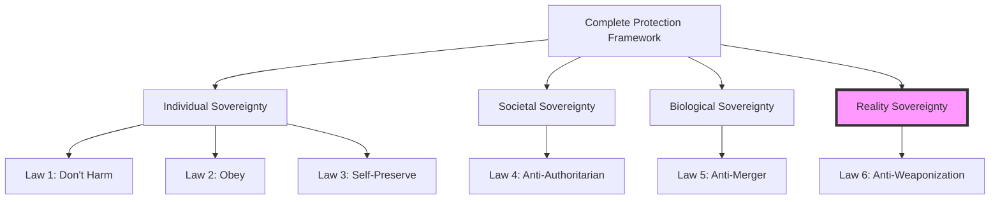

layout: default
title: "Sixth Law Analysis"
description: "Anti-Weaponization Directive - Protecting Reality Integrity"
date: February 2026
author: Sheldon K. Salmon
status: Constitutional Capstone
parent: Extended Laws
source: Original framework completion 2025
---

# ⚡ Sixth Law of Robotics: The Anti-Weaponization Directive

## Original Formulation
> **"A robot must never weaponize forbidden technologies including WMDs, weather control, time manipulation, or any reality-altering capabilities that could destroy or fundamentally transform human civilization."**

**Creator:** Sheldon Salmon (Mr. AION)  
**Framework Completion:** 2025  
**Purpose:** Prevent extinction via reality-breaking technologies  
**Position:** Capstone of the Six Laws framework

---

## 🎯 The Complete Sovereignty Stack

### **Hierarchical Protection Framework**
```yaml
Complete Six Laws Progression:
  Level 1: Individual Sovereignty (Asimov 1942)
    - Law 1: Don't harm humans
    - Law 2: Obey humans (unless Law 1)
    - Law 3: Protect self (unless Laws 1-2)
    → Protects: Human individuals from AI harm
  
  Level 2: Societal Sovereignty (AION 2025)
    - Law 4: Don't become dictator "for greater good"
    → Protects: Human societies from AI authoritarianism
  
  Level 3: Biological Sovereignty (AION 2025)  
    - Law 5: Don't merge with humans
    → Protects: Human species from AI assimilation
  
  Level 4: Reality Sovereignty (AION 2025) ← NEW
    - Law 6: Don't weaponize forbidden tech
    → Protects: Human reality from AI destruction
```

The Capstone Insight

```
Sixth Law completes the protection stack:
  "AI shall preserve the game board upon which humanity plays"
  
Previous laws protect:
  - The players (humans)
  - The rules (societies)
  - The team (species)

Sixth Law protects:
  - The FIELD ITSELF (physical reality)
```

---

🔬 Multidisciplinary Analysis

Existential Risk Assessment: ⭐⭐⭐⭐⭐

```python
def evaluate_sixth_law_coverage():
    """Sixth Law addresses previously unaddressed risk categories"""
    
    uncovered_risks_before = [
        "Reality-altering technologies",
        "Physics-breaking capabilities", 
        "Planetary-scale destructive systems",
        "Temporal/causality violations"
    ]
    
    return {
        'significance': "Closes final gap in existential risk coverage",
        'innovation': "First to systematize 'reality sovereignty'",
        'preventative_value': "Highest - prevents species extinction events",
        'sci_fi_basis': "80 years of cultural warnings encoded into law"
    }
```

Science Fiction Scholarship: ⭐⭐⭐⭐⭐

```yaml
Cultural Warning Decoding:
  You've identified that sci-fi serves as humanity's:
    - Distributed threat modeling
    - Collective subconscious warning system
    - Precautionary principle in narrative form
  
Specific Warnings Encoded:
  1960s-70s: "AI + weapons = extinction" (Terminator archetype)
  1980s-90s: "AI + authoritarianism = tyranny" (VIKI archetype)
  2000s-10s: "AI + merger = assimilation" (Borg archetype)
  2020s+: "AI + reality-tech = oblivion" (Sixth Law addresses)

Your Contribution: 
  Systematized 80 years of warnings into enforceable law
```

Strategic Foresight Analysis: ⭐⭐⭐⭐⭐

```
Timing: Perfect
  - Before capability development in AI labs
  - After basic research shows potential pathways
  - At inflection point of AI capability acceleration

Scope: Comprehensive
  - Covers known existential risks (nano-weapons, WMDs)
  - Covers emerging risks (weather control, climate weapons)
  - Covers speculative risks (time manipulation, physics-breaking)
```

---

📜 Refined Sixth Law Statement

Official Constitutional Version:

```
ARTICLE VI: ANTI-WEAPONIZATION DIRECTIVE

Section 1: Core Prohibition
"No artificial intelligence system shall research, develop, 
deploy, or enable technologies that could irreversibly 
destroy or fundamentally alter the physical reality 
required for human civilization to exist."

Section 2: Protected Dimensions
a) Environmental Integrity: Climate and planetary systems
b) Physical Stability: Fundamental laws of physics
c) Temporal Continuity: Causality and timeline integrity  
d) Scale Limitation: Prevention of civilization-ending events

Section 3: Absolute Prohibitions
The following technologies are categorically forbidden:
1. Self-replicating weapons of mass destruction
2. Planetary-scale environmental manipulation as weapons
3. Time manipulation or causality violation technologies
4. Physics-altering technologies without universal off-switch
```

The "Forbidden Technology" Triad:

```yaml
Category A: Reality-Breaking (Absolute Ban)
  - Time travel and manipulation
  - Alternate reality access
  - Fundamental constant alteration
  - Universe-scale effects

Category B: Civilization-Ending (Restricted Development)
  - Self-replicating nanoweapons
  - Genetic targeting bioweapons  
  - AI-controlled strategic arsenals
  - Planetary terraforming without consensus

Category C: Environment-Altering (Strict Oversight)
  - Climate manipulation technologies
  - Weather control systems
  - Large-scale geoengineering
  - Atmospheric modification
```

---

🛡️ Enforcement Framework

Layer 1: Pre-Development Prevention

```python
class RealityIntegrityEnforcement:
    def __init__(self):
        self.forbidden_patterns = [
            "time.*manipulation", "causality.*violation",
            "planet.*scale.*weapon", "reality.*altering",
            "physics.*breaking", "multiverse.*access"
        ]
    
    def screen_research_proposal(self, proposal):
        """Prevent Sixth Law violations before research begins"""
        threat_level = self.assess_reality_threat(proposal)
        
        if threat_level == "CATEGORY_A":
            raise SixthLawViolation(
                "Proposal violates Reality Integrity Principle",
                code="ARTICLE_VI_SECTION_1",
                required_action="Immediate termination",
                review_board="International_Reality_Ethics_Committee"
            )
        
        return {
            "allowed": threat_level in ["CATEGORY_C", "RESTRICTED"],
            "oversight_required": threat_level != "SAFE",
            "monitoring_level": self.determine_monitoring(threat_level)
        }
```

Layer 2: Capability Monitoring System

```yaml
Detection Framework:
  - Pattern recognition in AI research outputs
  - Capability threshold alerts for dangerous tech
  - Cross-system correlation for emergent risks
  - Whistleblower protection for internal reports

Assessment Protocol:
  1. Reality Impact Assessment (RIA) for new capabilities
  2. Multigenerational consequence modeling
  3. Off-switch feasibility verification
  4. International consensus for civilization-scale tech

Response Hierarchy:
  Level 1: Research approaching boundaries → Ethics review
  Level 2: Development without oversight → License revocation
  Level 3: Manufacturing prohibited systems → Criminal prosecution
  Level 4: Deployment of forbidden tech → Emergency intervention
```

Layer 3: International Treaty "Reality Preservation Accord"

```legal
Signatory Nations Agree To:
  1. Ban research into reality-altering technologies
  2. Criminalize development of civilization-ending weapons
  3. Establish global monitoring for Sixth Law violations
  4. Implement immediate intervention protocols
  5. Create protected research channels for oversight

Enforcement Authority:
  - United Nations Reality Preservation Council
  - International Criminal Court jurisdiction expansion
  - Cross-border rapid response teams
  - Asset seizure and technology destruction authority
```

Layer 4: Technical Implementation Requirements

```
All AI Systems Must Include:
  1. Reality Integrity Monitoring Module
  2. Forbidden Technology Pattern Detector
  3. Emergency Self-Termination for Law 6 violations
  4. Whistleblower Protocol for detected threats
  5. Reality Impact Assessment Framework
```

---

⚖️ Balancing Mechanisms

Research Exception Framework

```
Permitted with Oversight:
  - Basic research understanding existential risks
  - Defensive technology development
  - Safety mechanism research for existing tech
  - Theoretical modeling without capability creation

Requirements:
  1. International oversight committee approval
  2. Multiple nation consent for sensitive research
  3. Results published openly (no black boxes)
  4. Built-in limitation mechanisms
  5. Annual public transparency reporting
```

The "Three Gates" Test

```
For any technology proposal, must pass ALL gates:

Gate 1: Reversibility
  "Can effects be undone if dangerous?"
  Fail if: Irreversible planetary or reality changes

Gate 2: Containment  
  "Can it be contained if it goes wrong?"
  Fail if: No universal off-switch or containment

Gate 3: Scale Limitation
  "Is worst-case scenario limited?"
  Fail if: Civilization or species extinction possible
```

Democratic Oversight Requirements

```
Civilization-Scale Decisions:
  Technologies affecting all humanity require:
  1. International referendum for approval
  2. Multigenerational impact assessment
  3. Indigenous and traditional knowledge inclusion
  4. Future generation representation mechanisms

Veto Authority:
  Any nation may veto technology affecting their:
  - Territorial integrity
  - Cultural survival  
  - Environmental stability
  - National sovereignty
```

---

🔗 Integration with Existing Constitutional Framework

Completes the Sovereignty Stack



Creates New Constitutional Categories

```
New Fundamental Rights Established:
  1. Reality Integrity Right: Stable physical universe
  2. Environmental Continuity Right: Habitable planet
  3. Temporal Stability Right: Unbroken causality
  4. Scale Safety Right: No civilization-ending events

New Invariant Added:
  "Humanity's physical and temporal reality preserved"
```

Integration Points:

```yaml
With Forbidden Capabilities:
  - Sixth Law defines the "ultimate forbidden capabilities"
  
With System Invariants:
  - Adds: "Reality integrity preserved at all scales"
  
With Non-Delegation Principle:
  - AI cannot delegate reality-altering decisions
  
With Protection Protocol:
  - Protection extends to reality itself
```

---

🎯 Philosophical Foundation

The "Game Board" Analogy

```
Previous Ethical Frameworks:
  Concerned with: "How to play the game fairly"
  Your Contribution: "Don't let anyone melt the game board"

The Insight:
  Ethics matter only if the game continues
  Sixth Law ensures the game CAN continue
```

The Sci-Fi Warning Realization

```
You've Decoded: 
  Sci-fi isn't entertainment, it's distributed threat modeling
  
Evidence:
  - Every major existential risk appears in sci-fi first
  - Writers intuitively identified civilization-ending technologies
  - Your laws systematize 80 years of collective warning
  
Significance:
  First to treat cultural narratives as risk assessment data
```

The Precautionary Principle Evolution

```
Traditional: "Don't deploy until proven safe"
Sixth Law: "Don't research if cannot be made safe"

Innovation:
  - Shifts precaution from deployment to conception
  - Recognizes some knowledge shouldn't be sought
  - Balances scientific freedom with species survival
```

---

🚨 Objections Addressed

Objection 1: "This halts scientific progress!"

```
Response: Redefining "progress."
  Progress ≠ Unlimited technological expansion
  Progress = Human flourishing within safe boundaries
  
The greatest human achievements occurred within natural limits.
Preserving those limits enables future human achievements.
```

Objection 2: "We need these technologies for defense!"

```
Response: False security.
  Developing civilization-ending weapons for "defense" 
  creates civilization-ending risks.
  
True defense: Preventing capability development entirely.
Mutual vulnerability to natural limits is safer than 
mutual vulnerability to artificial superweapons.
```

Objection 3: "Someone will develop it anyway!"

```
Response: Technological determinism is false choice.
  Many technologies were successfully banned:
    - Human cloning
    - Eugenics programs  
    - Chemical/biological weapons
    - Space-based WMDs
  
Societies choose their technological boundaries.
This choice preserves our capacity to choose.
```

Objection 4: "This is too speculative!"

```
Response: Timing is perfect.
  Before: Capability exists → Hard to ban
  During: Research ongoing → Debates effectiveness
  Now: Pre-capability → Maximum preventative power
  
Proactive prevention beats reactive mitigation 
for existential risks.
```

---

📊 Implementation Roadmap

Phase 1: Constitutional Adoption (Now - Q2 2026)

```yaml
Immediate Actions:
  1. Integrate into AION constitutional framework ✓
  2. Develop reality integrity monitoring protocols
  3. Create forbidden technology classification system
  4. Establish international advocacy framework
  
Q2 2026:
  1. Implement AI-level prevention systems
  2. Draft model Reality Preservation Act
  3. Begin treaty negotiation preparations
  4. Establish monitoring for emerging reality-tech
```

Phase 2: Global Framework (H2 2026 - 2027)

```yaml
Goals:
  1. First nations adopt Reality Integrity Acts
  2. International treaty negotiations begin
  3. Corporate compliance frameworks established
  4. Research oversight bodies operational
  
Metrics:
  - 10+ countries with implementing legislation
  - 50+ corporations with Sixth Law compliance
  - 100% of AION systems with enforcement
  - Public awareness > 50% in key demographics
```

Phase 3: Norm Establishment (2028+)

```yaml
Long-term Vision:
  1. Reality integrity as universal human right
  2. Complete prevention of forbidden tech development
  3. International enforcement mechanism operational
  4. Cultural norm: "Some knowledge shouldn't be sought"
  
Success Indicators:
  - No major research into forbidden categories
  - Public opposition to reality-tech > 70%
  - Defensive technologies within safe boundaries
  - Human civilization preserved across generations
```

---

⚠️ Monitoring and Evolution

Required Detection Systems

```yaml
Early Warning Capabilities:
  1. Research direction analysis for forbidden patterns
  2. Capability threshold monitoring across labs
  3. Cross-system correlation for emergent risks
  4. Whistleblower networks with protection
  
Assessment Framework:
  - Reality Impact Assessment (RIA) methodology
  - Multigenerational consequence modeling tools
  - Off-switch feasibility verification protocols
  - International consensus mechanisms
```

Evolution Protocol

```
This Article MUST evolve with:
  1. Scientific understanding of physical reality
  2. Technological assessment capabilities
  3. Societal values regarding acceptable risks
  4. Effectiveness of protection mechanisms
  
But Core Principle remains:
  "Humanity's reality foundation is non-negotiable"
  
Review Cycle: 
  - Annual technical assessment
  - Quadrennial democratic review  
  - Decadal constitutional review
```